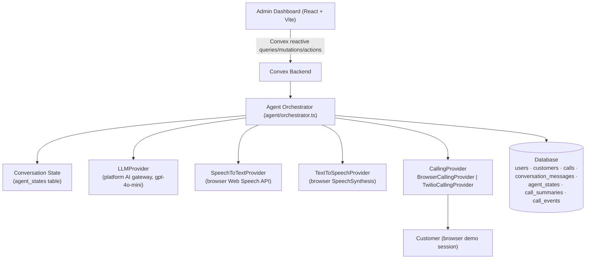

# AgentSpeak AI — AI Voice Agents for Customer Outreach

AgentSpeak AI places AI voice agents that call a business's customers on its behalf. The agent
"calls" the customer (Browser Voice Demo over the microphone), conducts a natural two-way spoken
conversation with **explicit conversation state**, extracts structured lead information, persists
everything relationally, generates an AI summary after the call ends, and exposes it all through a
Studio-themed admin area with campaigns, scheduling, a knowledge base and credit billing.

> **Honesty note:** calls in this build run in **Browser Voice Demo mode** — microphone in, AI
> voice out. They are simulated conversations, never presented as real phone calls. A modular
> Twilio calling provider is included for real telephony when credentials are supplied (see
> [Real telephony mode](#real-telephony-mode)).

---

## Project overview

```
Admin Dashboard  →  Create/select customer  →  Start Call
        ↓
Browser Voice Demo session (mic + Web Speech API)
        ↓
Speech-to-Text  →  Agent Orchestrator  →  LLM (structured JSON decision)
        ↓                                            ↓
Text-to-Speech  ←  response  ←  state update, next action, lead status
        ↓
Conversation continues → call ends → AI summary → dashboard report
```

## Architecture



Key design points:

- **Provider abstractions** — `LLMProvider`, `SpeechToTextProvider`, `TextToSpeechProvider`,
  `CallingProvider`. The agent core contains zero vendor logic; each concern can be swapped.
- **Explicit agent state** — nine structured fields (`customer_name`, `company_name`,
  `requirement`, `ro_capacity`, `location`, `budget`, `timeline`, `application`,
  `additional_requirements`) are persisted per call in `agent_states`.
- **Structured decisions** — the LLM must answer in strict JSON; output is coerced/validated by
  `agent/rules.ts` and never trusted blindly.
- **Context strategy** — the prompt carries the structured state plus only the last 12 raw turns;
  history length stays bounded regardless of call length.

## Features

- Customer CRUD with server-side validation (name length, phone digit count, normalization).
- One-click **Start Call** per customer → opens a Browser Voice Demo session.
- Real-time call console: Connecting → AI speaking → Listening → Processing phases, live
  interim transcript, waveform animation, interrupt ("barge-in") button, end-call control.
- **Silence handling**: 8 s of silence → "Are you still there?" → "I'll wait a little longer…" →
  after 3 strikes the call ends gracefully. All prompts are persisted.
- **Barge-in**: press *Interrupt & speak* while the AI is talking to stop TTS and re-open the mic
  (documented limitation: automatic voice-activity barge-in is not provided by the Web Speech API).
- Transcript, agent state (collected vs. missing fields), event log and AI summary per call.
- Dashboard metrics (total/completed/failed calls, interested leads, follow-ups, average duration,
  conversion rate, calls-by-status) — **all computed live from database records**.
- Call history with filters: status, lead status, follow-up flag, customer, text search.
- Event logging: `call_initiated`, `call_connected`, `agent_processing`, `agent_error`,
  `tts_failed`, `customer_silent`, and more.

## Tech stack

| Layer     | Technology                                                        |
| --------- | ----------------------------------------------------------------- |
| Frontend  | React 19 + Vite + TypeScript, Tailwind CSS 4, shadcn/ui, Framer Motion |
| Backend   | Convex (queries / mutations / actions, internal functions)        |
| Database  | Convex storage (relational-style tables with indexes)             |
| AI        | Platform AI gateway — OpenAI-compatible `gpt-4o-mini`             |
| Voice     | Web Speech API (STT + TTS) behind provider interfaces             |
| Calling   | `BrowserCallingProvider` (demo) / `TwilioCallingProvider` (REST)  |
| Tests     | Vitest (agent decision rules — 15 unit tests)                     |

## Project structure

```
src/
  convex/                     # backend
    schema.ts                 # all tables + validators
    customers.ts              # customer CRUD (validated)
    calls.ts                  # call lifecycle queries/mutations
    callsInternals.ts         # internal q/m used by agent actions
    dashboard.ts              # stats computed from DB
    config.ts                 # capability status
    agent/
      rules.ts                # pure decision rules (tested)
      llm.ts                  # LLMProvider implementation
      orchestrator.ts         # greeting / turn / silence / summarize actions
    calling/
      providers.ts            # CallingProvider abstraction (browser | twilio)
    lib/validation.ts         # phone/name validators (pure)
  hooks/
    use-voice-call.ts         # browser voice session (STT/TTS + agent loop)
  lib/voice/
    stt.ts                    # SpeechToTextProvider (browser impl)
    tts.ts                    # TextToSpeechProvider (browser impl)
  pages/
    Landing.tsx               # Studio-themed landing
    dashboard/
      Overview.tsx  Customers.tsx  Calls.tsx  CallDetail.tsx  CallConsole.tsx
tests/
  agent-rules.test.ts         # unit tests (no external APIs)
```

## Running the app

This project runs as a managed Freebuff web app: the dev server and Convex dev process are run by
the platform; your edits hot-reload in the preview. For local reproduction outside the platform:

1. Install dependencies: `bun install`
2. Set up a Convex deployment: `bunx convex dev` (generates `src/convex/_generated`)
3. Start the frontend: `bun run dev`
4. Open the app, sign in (email OTP or guest), and go to `/dashboard`.

No separate PostgreSQL instance is required — the Convex deployment is the database (the schema
mirrors the assignment's relational design one-to-one: `customers`, `calls`,
`conversation_messages`, `call_summaries`, plus `agent_states` and `call_events`).

### Demo mode (Browser Voice Demo)

1. Sign in → **Customers** → **Add customer** (name + phone required).
2. Press **Start Call** on the customer card → the live console opens.
3. Press **Start voice session** and allow the microphone.
4. Talk naturally: Aria greets, asks about capacity/location/budget/timeline/application, and
   never repeats an answered question. The right rail fills with collected fields.
5. Press **End call** (or let the agent close) → the AI summary is generated from the transcript.
6. Open the call from **Calls** to see the transcript, summary, agent state and event log.

Requires Chrome/Edge (Web Speech API). The mode is always labelled "Browser Voice Demo" — it is
not a phone call.

### Real telephony mode

`TwilioCallingProvider` (`src/convex/calling/providers.ts`) implements `initiateCall`, `endCall`
and `getCallStatus` against the Twilio REST API and is selected by `CALLING_PROVIDER=twilio` /
`CALL_MODE=telephony` in a self-hosted deployment. Provide `TWILIO_ACCOUNT_SID`,
`TWILIO_AUTH_TOKEN`, `TWILIO_FROM_NUMBER` via environment variables; without them the provider
raises a clear configuration error and the app stays in browser mode. The agent core is unchanged
between modes — only the transport swaps.

## AI workflow (agent state & decision loop)

1. Customer speech is stored as a `conversation_messages` row (speaker `customer`).
2. The orchestrator loads the latest `agent_states` row + recent transcript.
3. The LLM receives: system prompt (persona, rules) + structured state + last 12 turns.
4. It must return strict JSON: `extracted_data`, `missing_fields`, `next_action`, `response`,
   `should_end_call`, `lead_status`.
5. The decision is coerced/validated (`coerceDecision`); extracted fields are merged into state
   (filled fields are never overwritten by blanks); stage machine advances
   `greeting → discovery → qualifying → closing`.
6. State, AI message, lead status and follow-up flags are persisted; the response is spoken.
7. On call end, `summarize` action generates the structured summary from the actual transcript and
   updates the call row.

## Database schema

| Table                  | Purpose |
| ---------------------- | ------- |
| `customers`            | name, phone, company, purpose, product (indexed by created_at, phone) |
| `calls`                | customer FK, mode, direction, status, outcome, lead_status, follow-up, duration, error |
| `conversation_messages`| call FK, speaker (customer/ai/system), message, sequence, metadata, timestamp |
| `call_summaries`       | call FK, summary, intent, key requirements, budget, timeline, location, application, lead/outcome |
| `agent_states`         | call FK, collected fields, stage, turn count |
| `call_events`          | call FK, event name, detail, timestamp (debug/audit trail) |
| `campaigns`            | catalog of outbound programs the agent calls about (product, price, highlights) |
| `scheduled_calls`      | pre-booked call slots with campaign context and agent notes |
| `orders`               | credit-pack purchases (Stripe or simulated checkout) |
| `call_comments`        | team notes on customers and specific calls |
| `knowledge_posts`      | published playbooks and scripts |
| `users`                | managed by Convex Auth (email OTP + anonymous) |

## Error handling

- LLM failure → logged (`agent_error`), spoken fallback ("Could you repeat that?"), call survives.
- STT failure / denied mic → explicit UI error state; silence timer still guards the session.
- TTS failure → logged (`tts_failed`), conversation continues visually via transcript.
- Customer silence → escalating prompts, then graceful end with `customer_unavailable` semantics.
- Call already ended → actions reject with "Call has already ended."
- DB-level validation → invalid phone/name rejected server-side with clear messages.
- One failing call never affects others (per-call actions and per-call rows).

## Free/trial limitations (stated honestly)

- **AI**: uses the platform's OpenAI-compatible gateway (`gpt-4o-mini`). No separate key needed in
  this environment; self-hosted deployments need their own key via `LLM_API_KEY`.
- **STT/TTS**: browser Web Speech API — free, but Chrome/Edge only and voice quality varies by OS.
  Continuous automatic barge-in is **not** supported; a manual interrupt button is provided.
- **Calling**: real phone calls require a Twilio account (paid after trial). This build ships the
  provider abstraction + REST implementation but runs in **Browser Voice Demo** mode.

## Future improvements

- Server-side streaming STT (e.g. Whisper) for lower latency and non-Chromium browsers.
- True VAD-based barge-in over a media WebSocket (Twilio Media Streams / Pipecat).
- Call recording storage and playback; multilingual voice sessions.
- Authentication roles (admin/operator), CRM integrations, human-handoff escalation.
- Production telephony scaling with queueing and retry policies.

## Admin area capabilities

- **Campaigns (catalog)** — browse and search outbound programs; each campaign has a product
  brief, price label and highlights; detail pages include a launch panel (call now or schedule).
- **Schedule** — book agent calls in advance with campaign context and notes; upcoming and past
  lists with cancellation.
- **Billing & credits** — 1 credit = 1 call minute. Credit packs checkout through **Stripe** when
  `STRIPE_SECRET_KEY` is configured (hosted Checkout via REST, order completed from webhook-style
  confirmation); without keys, a clearly-labelled simulated checkout completes the demo purchase.
  Calls require at least one credit to start.
- **Knowledge base** — the team publishes playbooks and scripts; searchable list and detail pages.
- **Comments** — team notes per customer and per call, shown alongside transcripts.

## Testing

```
bun run test        # 15 unit tests: missing-field detection, stage machine,
                    # lead-status derivation, silence policy, decision coercion,
                    # JSON salvage parsing
```

External APIs are never called in tests; agent rules are pure functions.
